# [Write Up] NSConclave CTF 2020 
## -- by *[Rohit Misuriya](https://twitter.com/root_viper)*

In this post, I'm going to describe solutions of **NSConclave CTF 2020**
Organized by **Net-Square Solutions Pvt. Ltd.** That was a very
interesting CTF event. Firstly I have to sign-up on a domain where we
got to know about the challenges.

## Challenge: Discord

Well according to me it was just a welcome step, It was not a
kind of challenge, I just need to click on the the link which
was provided on the domain and join the group on discord where
I got the 1st Flag:

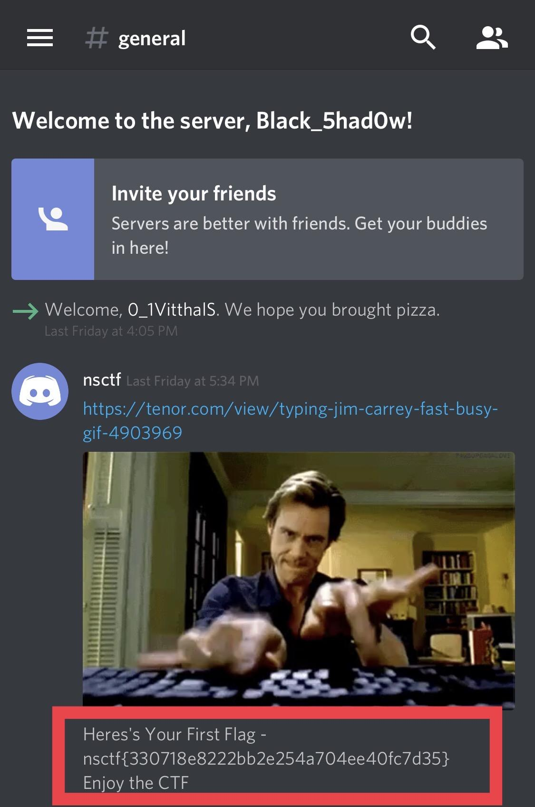

## Challenge: Prime

In this challenge I got that something is running on port 13337,
so I tried to ping on this port with Netcat and I receive a
message "Prime or not? (Y/N) : {random 3 digit number}".

Then I tried to send a random answer and I got that it'll only
continue the session when I'll send the right and valid
answer(Prime or not Y/N) otherwise it'll disconnect the
session and I have to connect it again.

So I made a python script which connects with that port and get
the data, check the number whether it is prime or not and send
the valid answer and receive the next number, This script
would do the same process in a loop until I got the flag.
    
**My Script:**

I ran that script and after 200+ requests, I got the flag.

>\#\!/usr/bin/python 
>import socket 
>import time 
>import array 
>
>*\#define a function to compare the values* 
>
>def check(words, rev):  
>    for x in words:   
>        if rev == x:  
>            return True 
>    return False 
>
>hs = "192.168.196.167"  *\#Target IP* 
>pt = 13337              *\#Target Port* 
>words = [1, 2, 3, 5, 7, 11, 13, 17, 19, 23, 29, 31, 37, 41, 43, 47, 53, 59, 61, 67, 71, 73, 79, 83, 89, 97, 101, 103, 107, 109, 113, 127, 131, 137, 139, 149, 151, 157, 163, 167, 173, 179, 181, 191, 193, 197, 199, 211, 223, 227, 229, 233, 239, 241, 251, 257, 263, 269, 271, 277, 281, 283, 293, 307, 311, 313, 317, 331, 337, 347, 349, 353, 359, 367, 373, 379, 383, 389, 397, 401, 409, 419, 421, 431, 433, 439, 443, 449, 457, 461, 463, 467, 479, 487, 491, 499, 503, 509, 521, 523, 541, 547, 557, 563, 569, 571, 577, 587, 593, 599, 601, 607, 613, 617, 619, 631, 641, 643, 647, 653, 659, 661, 673, 677, 683, 691, 701, 709, 719, 727, 733, 739, 743, 751, 757, 761, 769, 773, 787, 797, 809, 811, 821, 823, 827, 829, 839, 853, 857, 859, 863, 877, 881, 883, 887, 907, 911, 919, 929, 937, 941, 947, 953, 967, 971, 977, 983, 991, 997] *\#Prime values between 000 to 999* 
>s = socket.socket(socket.AF_INET, socket.SOCK_STREAM) 
>s.connect((hs, pt))     *\#Connect with socket to the target* 
>time.sleep(0.5)         *\#Wait for getting the value from the target* 
>data = s.recv(1024)     *\#Receive data from the target* 
>rev = data[-4:-1]       *\#Get the numbers form data* 
>rev = int(rev)          *\#Convert/check the numbers* 
>while True:		*\#Start a loop to send the answer* 
>	if(check(words, rev)):  *\#Call the function to check the value whether it is prime or not* 
>		s.send("Y") 
>	else: 
>		s.send("N") 
>	time.sleep(0.5)         *\#Again wait for the response from target* 
>	rev =  s.recv(1024) 
>	print rev               *\#Print the Received data/Flag* 
>	rev = rev[-4:-1] 
>	rev = int(rev)          *\#Check data, if it is asking for the prime numbers again then continue the loop otherwise break it with the Flag* 

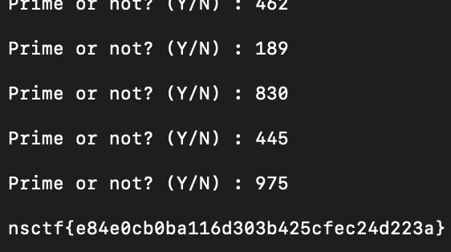

## Challenge: Yuddha

In this challenge I got a URL, and when I opened that URL I got
an image of Mahabharat yuddha with the name Kurushetra.jpg. So I downloaded that image, and I realized that this is a
steganography challenge so I used Binwalk tool to check the image and I found that there is a zip file inside that image So I used Stegextract tool to extract the zip file from the image.
    
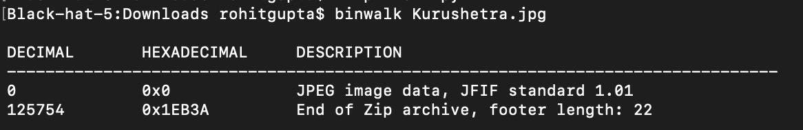

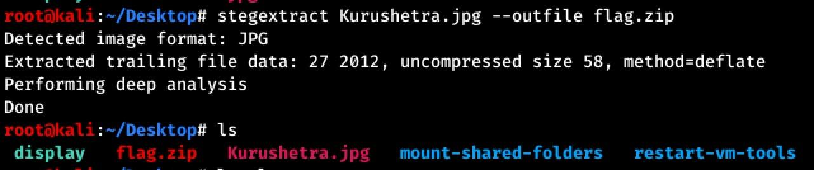

But when I tried to open it, it said unsupported file type, So this
time I had opened that zip file with the hex editor and at the same time I had opened a valid zip file with hex editor
which I had compressed before and compared Both files, So I got that the 1st byte of this new zip
was different as I already know that every file has their own
mime-type signature so I had changed the byte from FF to 50 and saved it.

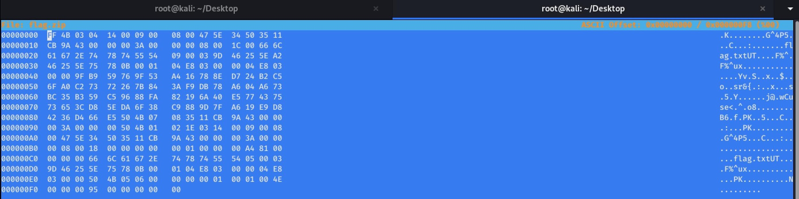

And guess what another challenge is waiting for me, the zip was
password protected but this time I got the password hint from the Discord group(1st
challenge). {n0******}

Finally I unlocked the zip file and got the flag:

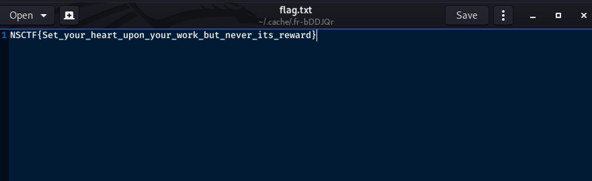

## Challenge: Webmin

In this challenge I found that Webmin service is running on
port 10000 so I directly searched for the exploit in exploit db and got
some exploits for RCE, but I did not have any credentials so I
had to use **webmin password\_change.cgi Backdoor** exploit
because credentials are required in all other RCE exploits.

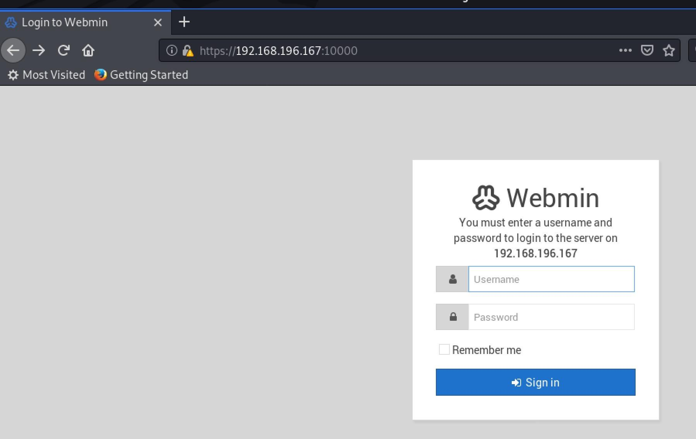

And I set everything and got a reverse shell easily.

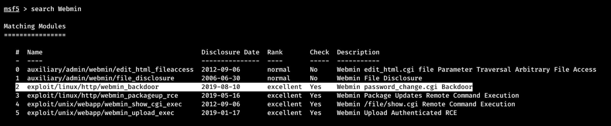

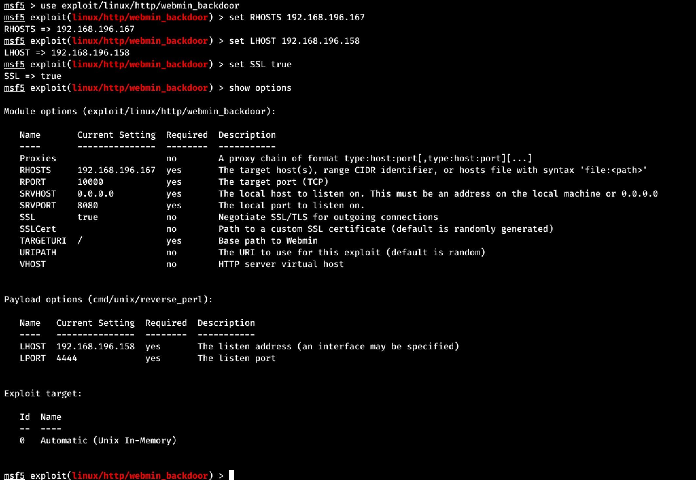

Then I spawn the shell with the help of python one-liner, and search for the flag, and finally I got the flag in a file with the name
**\_flag_.txt**.

After getting the shell when I was checking the source code and I
found that the credentials were saved in robots.txt
file(root:conclave), so at that moment I realize that I can use
other exploits as well.

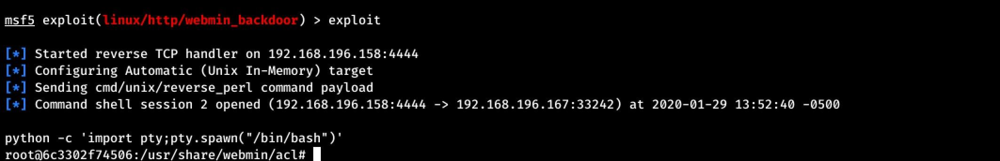

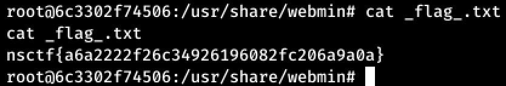
